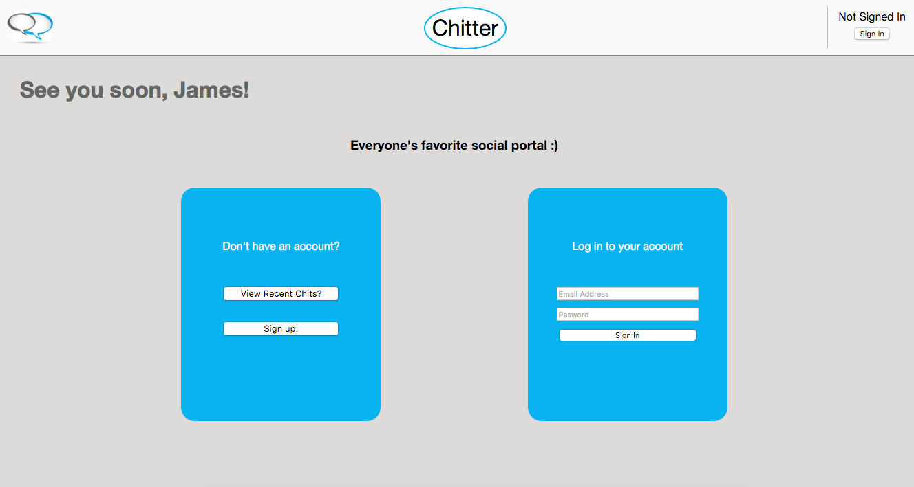
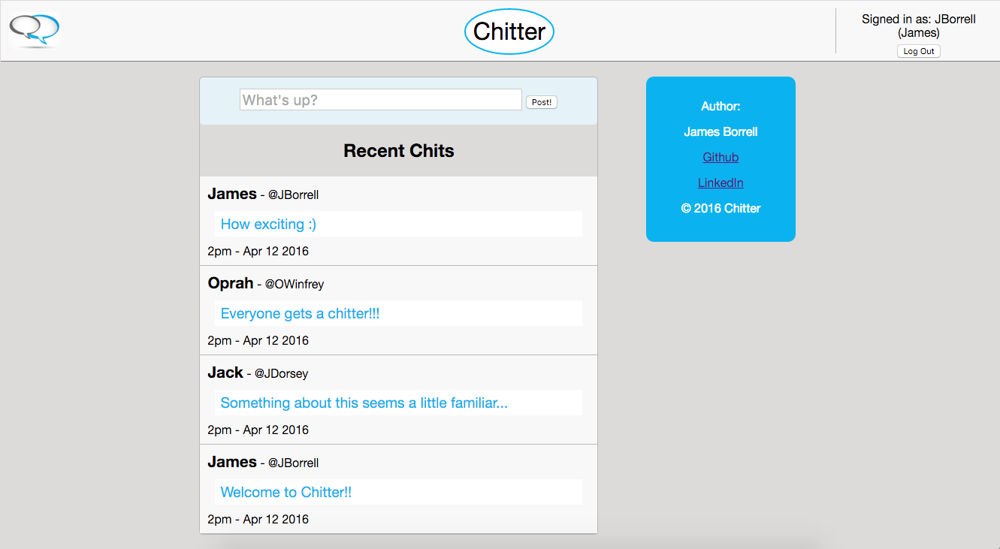

Welcome to Chatter!
===================

Chatter is an interactive social platform which allows users to sign up
for a service which allows them to post thoughts, activities, tasks, feelings or
pretty much anything they want, to a website where others can see it. The website
also allows users to read other users posts, showing them who posted what & at
what time the post was created!

Try it out here! https://www.chatter-live.herokuapp.com

To Run:
-------

1. Fork this repo onto your local machine
2. Navigate into the repository home folder
3. Run 'bundle' in your terminal to acquire the necessary gems
4. Create a database using 'createdb chitter_development' in terminal
5. Create database connections using 'rake db:migrate' in terminal
6. Use the 'rackup' command to load up the website
7. Open your browser & visit 'localhost:9292'
8. Follow the interactive prompts & have fun!

Testing
----
* Initialize rspec in the main folder
* Create test database by running 'createdb chitter_test' in your terminal
* Create database connections using 'rake db:migrate RACK_ENV="test"' in terminal
* Run 'rspec' in terminal to see tests for the code

Technologies
-----------
List of technologies used:

* Ruby 2.2.3
* DataMapper
* DataMapper Postgres Adapter
* Sinatra
* Rspec
* Capybara
* Database Cleaner
* Rake
* Sinatra Flash
* BCrypt Ruby
